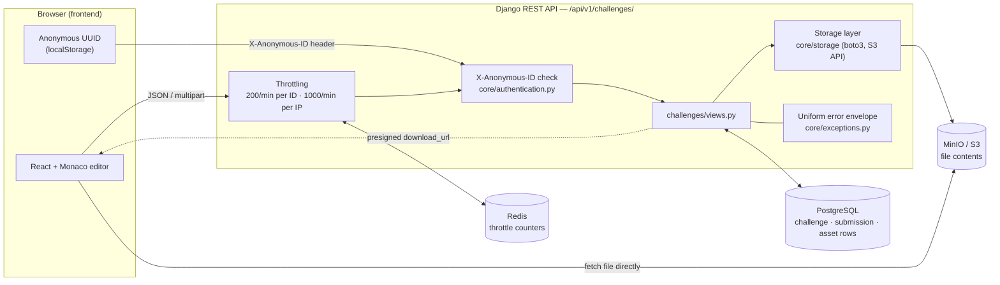
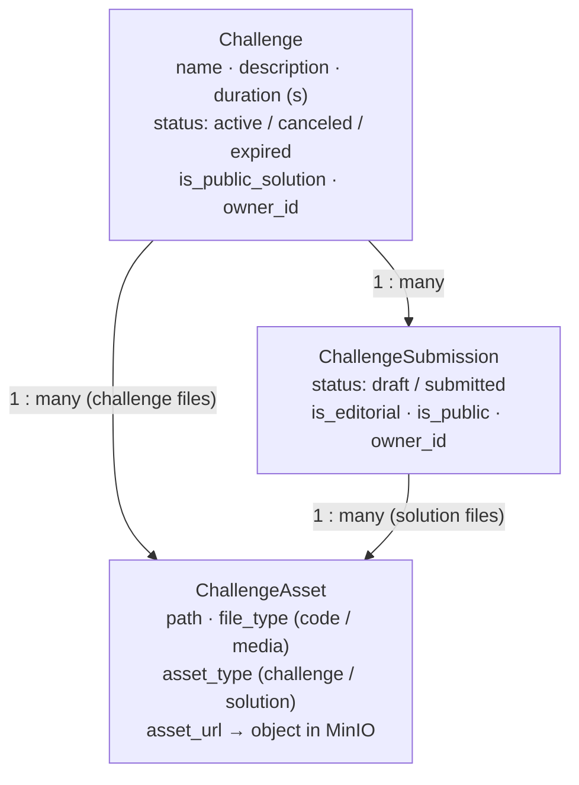
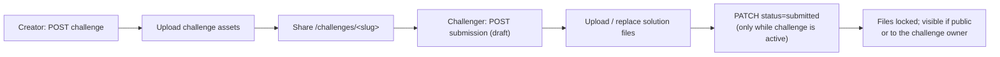
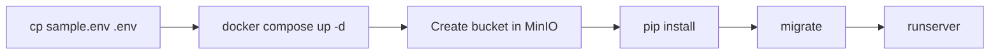

# Tsundre Ride — Backend

**Problem:** Running a quick frontend coding challenge with friends or a team means setting up repos, accounts and a way to collect everyone's code.
**Solution:** A Django REST API where anyone can create a time‑boxed HTML/CSS/JS challenge, share its link, and collect submissions. There are no accounts and no setup for the people taking part. The [frontend](../frontend) is the in‑browser editor and preview built on top of this API.

## How backend and frontend fit together

The backend stores challenges, submissions and their files. The frontend does all the editing and previewing in the browser. Neither side has user accounts: the browser makes up a random UUID, sends it as `X-Anonymous-ID`, and whoever holds the UUID that created something owns it.

## Architecture



### Data model



Each asset belongs to **exactly one** challenge or submission; a database check constraint enforces this. Files are stored at `challenges/<id>/<path>` or `submissions/<id>/<path>` in the bucket. Paths are checked so they can't be absolute or contain `..`.

### Request lifecycle



## API

Base URL: `http://localhost:8000/api/v1/challenges/`. Every write needs an `X-Anonymous-ID: <uuid>` header.

| Method | Path | Purpose |
|---|---|---|
| GET / POST | `/` | List (`search`, `status`, `owner_id`, `page`, `per_page_items`) / create a challenge |
| GET / PATCH / DELETE | `/<slug>/` | Read / edit / cancel (owner only for writes) |
| GET / POST | `/<slug>/assets/` | List / upload challenge files |
| GET / PATCH / DELETE | `/<slug>/assets/<asset>/` | One challenge file |
| GET / POST | `/<slug>/submissions/` | List visible submissions / start a draft |
| GET / PATCH / DELETE | `/<slug>/submissions/<sub>/` | Read / submit / delete a submission |
| GET / POST | `/<slug>/submissions/<sub>/assets/` | List / upload solution files (drafts only) |
| DELETE | `/<slug>/submissions/<sub>/assets/<asset>/` | Remove a solution file |

Every response, including errors, uses the same envelope:

```json
{ "message": "...", "success": true, "code": "...", "content": { }, "error": null }
```

## Running locally

**Requirements:** Python 3.12+ and Docker.



```bash
# 1. Environment
cp sample.env .env

# 2. Postgres (5434), MinIO (9000 / console 9001), Redis (6379)
docker compose --env-file .env up -d

# 3. Create the bucket named in STORAGE_BUCKET (default: challenge-files)
#    at http://localhost:9001  (login minioadmin / minioadmin123)

# 4. Python deps
python -m venv .venv
.venv\Scripts\activate          # Windows   |   source .venv/bin/activate on macOS/Linux
pip install -r requirements.txt django-redis

# 5. Database + server
python manage.py migrate
python manage.py runserver      # http://localhost:8000
```

Optional: `python manage.py createsuperuser` and then open `/admin/`.

### Environment variables

| Variable | Default (sample.env) | Notes |
|---|---|---|
| `DEBUG`, `SECRET_KEY` | `True`, dev key | Change both for any real deployment |
| `DATABASE_*` | `challenge_db` on `localhost:5434` | Matches `docker-compose.yml` |
| `STORAGE_ENDPOINT` | `http://localhost:9000` | Any S3‑compatible endpoint; leave empty for AWS S3 |
| `STORAGE_ACCESS_KEY` / `STORAGE_SECRET_KEY` | MinIO root credentials | |
| `STORAGE_BUCKET` | `challenge-files` | Must already exist |
| `STORAGE_REGION`, `STORAGE_USE_SSL` | `us-east-1`, `False` | |
| `REDIS_HOST` / `REDIS_PORT` / `REDIS_DB` | `localhost` / `6379` / `1` | Used for the throttling cache |

## Project layout

```
core/            settings, URL root, anonymous-ID auth, throttles, error handler, storage client
challenges/      models, serializers, views, URLs for challenges / submissions / assets
docker-compose.yml   Postgres + MinIO + Redis for local dev
```

## Status

Done: challenge, asset and submission APIs, and the draft → submitted lifecycle.
Not built yet: a leaderboard, automatic expiry and cleanup when a challenge's time runs out, tests, and deployment. See [TODO](TODO).
